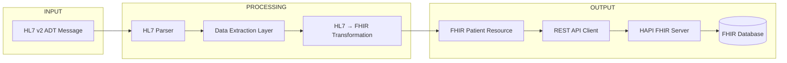

# HL7 to FHIR Integration Pipeline (Python)

## Overview
This project demonstrates a real-world healthcare interoperability workflow by converting HL7 v2 ADT messages into FHIR Patient resources using Python.

It simulates how legacy hospital systems communicate with modern API-based healthcare platforms by parsing HL7 messages, transforming the data, and sending it to a live FHIR server.

---


## Technologies Used

- Python
- HL7 v2 (ADT A01 Message)
- FHIR R4 Standard
- REST API Integration
- JSON Data Transformation

---

## Features

- Parses HL7 v2 ADT messages
- Extracts patient demographic data (name, DOB, gender)
- Transforms HL7 format into FHIR-compliant JSON
- Sends Patient resource to a live FHIR API
- Handles duplicate prevention using unique identifiers
- Demonstrates real-world healthcare data flow

---

## Architecture Diagram


---

## Sample HL7 Message

MSH|^~&|SendingApp|Hospital|ReceivingApp|FHIRServer|202604241200||ADT^A01|12345|P|2.3
PID|1||123456^^^Hospital||Doe^John||19900101|M|||

---

## Sample FHIR Output

```json
{
  "resourceType": "Patient",
  "id": "b45e1626-9d5f-471c-a393-ac4494cd1c45",
  "name": [
    {
      "family": "Doe-930884eb",
      "given": ["John"]
    }
  ],
  "gender": "male",
  "birthDate": "1990-01-01"
}
```

---

## ⚠️ Challenges & Solutions

During development, several real-world integration challenges were encountered:

### 1. HL7 Parsing Issues
Initial parsing using a Python HL7 library failed to correctly identify segments due to formatting inconsistencies.  
**Solution:** Implemented manual parsing logic to reliably extract PID segment data.

### 2. Duplicate Resource Errors (FHIR 412)
Repeated submissions of identical patient data resulted in duplicate resource errors from the FHIR server.  
**Solution:** Introduced dynamic identifiers to ensure unique patient creation.

### 3. PUT Request Constraints (FHIR 400)
FHIR server required matching resource IDs in both the request body and URL for PUT operations.  
**Solution:** Established a single source of truth for resource IDs across the request.

### 4. Public FHIR Server Limitations
Using a shared test server introduced constraints such as duplicate detection and persistent data.  
**Solution:** Adjusted request logic to accommodate server behavior and ensure successful responses.
